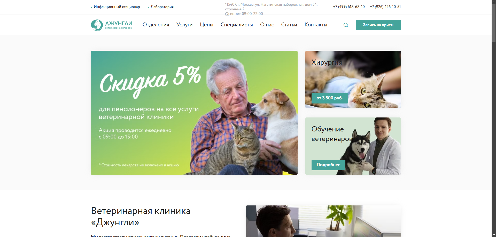
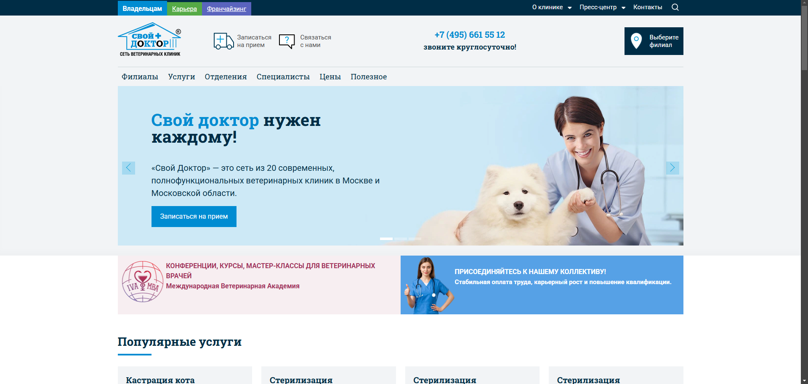
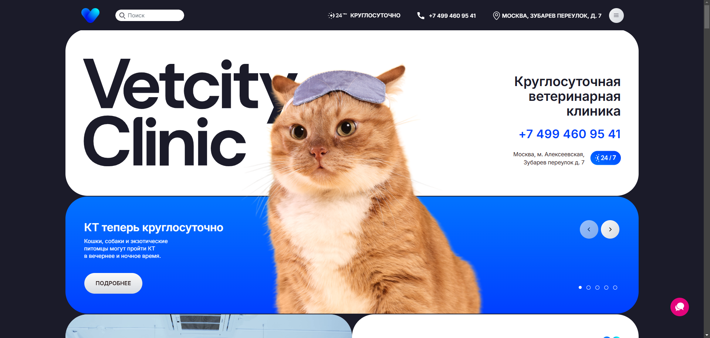

# Курсовая работа по дисциплине «Веб-технологии»
**Выполнил**: Студент группы 241-671 Закс Д. А.

## 1. Анализ аналогов (сайтов ветеринарных клиник)

### 1.1  [Ветеринарная клиника «Джунгли»](https://junglevet.ru/)



#### Структура сайта
- **Главная страница**: представляет общую информацию о клинике, перечень услуг и контактные данные.
- **Отделения**: разделы, посвященные различным направлениям, таким как хирургия, стоматология, кардиология и другие.
- **Услуги**: подробное описание предлагаемых медицинских услуг.
- **Специалисты**: информация о врачах клиники с их специализациями.
- **Цены**: прайс-лист на основные услуги.
- **О нас**: новости, фотогалерея, отзывы и статьи.
- **Контакты**: адрес, телефоны и режим работы.

```html
<!DOCTYPE html>
<html lang="ru">
  <head>
    <!-- Мета-теги, заголовок, подключение стилей и скриптов -->
  </head>
  <body>
    <header>
      <!-- Логотип, навигационное меню -->
    </header>
    <main>
      <section class="hero">
        <!-- Основной баннер с приветствием -->
      </section>
      <section class="services">
        <!-- Перечень услуг -->
      </section>
      <section class="about">
        <!-- Информация о клинике -->
      </section>
      <section class="contact">
        <!-- Контактная информация -->
      </section>
    </main>
    <footer>
      <!-- Дополнительные ссылки, копирайт -->
    </footer>
  </body>
</html>
```

#### Характеристика кода
- **Методология именования классов:** используется собственная схема именования классов без явного следования общепринятым методологиям, таким как BEM.
- **HTML5 теги:** активно используются семантические теги HTML5, такие как `<header>`, `<main>`, `<section>`, `<footer>`.
- **Обертки `<div>`:** количество оберток `<div>` минимизировано благодаря использованию семантических тегов, что улучшает читаемость кода.
- **Понятность кода:** структура кода логична и хорошо организована, что облегчает его понимание и поддержку.

#### Юзабилити
- **Навигация**: логичная и интуитивно понятная, основные разделы легко доступны.
- **Дизайн**: современный и приятный, с акцентом на удобство пользователя.
- **Контактная информация**: размещена на видном месте, что облегчает связь с клиникой.

#### Функциональность
- **Онлайн-запись**: возможность записи на прием через сайт отсутствует.
- **Информация о специалистах**: предоставлены данные о врачах и их специализациях.
- **Прайс-лист**: доступен для ознакомления, что позволяет оценить стоимость услуг.

### 1.2 [Ветеринарная клиника «Свой Доктор»](https://www.svoydoctor.ru/)



#### Структура сайта
- **Главная страница**: содержит общую информацию о сети клиник, новости и акции.
- **Филиалы**: список всех филиалов с адресами и контактами.
- **Услуги**: перечень предоставляемых услуг с описанием.
- **Отделения**: информация о специализированных отделениях, таких как дерматология, кардиология и другие.
- **Специалисты**: данные о врачах клиники.
- **Цены**: прайс-лист и информация об акциях.
- **Полезное**: статьи, клинические случаи и объявления.
- **О клинике**: миссия, отзывы и контакты.

```html
<!DOCTYPE html>
<html lang="ru">
  <head>
    <!-- Мета-теги, заголовок, подключение стилей и скриптов -->
  </head>
  <body>
    <div class="wrapper">
      <header class="header">
        <!-- Логотип, навигационное меню -->
      </header>
      <div class="content">
        <aside class="sidebar">
          <!-- Боковое меню с филиалами и услугами -->
        </aside>
        <main class="main-content">
          <section class="intro">
            <!-- Введение, приветственный текст -->
          </section>
          <section class="services">
            <!-- Перечень услуг -->
          </section>
          <section class="specialists">
            <!-- Информация о специалистах -->
          </section>
        </main>
      </div>
      <footer class="footer">
        <!-- Контактная информация, копирайт -->
      </footer>
    </div>
  </body>
</html>
```

#### Характеристика кода
- **Методология именования классов:** используется собственная схема именования классов без явного следования методологиям, таким как BEM.
- **HTML5 теги:** используются семантические теги, однако некоторые разделы обернуты в <div> с классами, что может усложнять восприятие структуры.
- **Обертки `<div>`:** присутствует значительное количество оберток <div>, что может усложнять понимание структуры страницы.
- **Понятность кода:** из-за большого количества вложенных <div> и отсутствия единой методологии именования классов код может быть сложен для восприятия и поддержки.

#### Юзабилити
- **Навигация**: структурированная, с быстрым доступом к основным разделам.
- **Дизайн**: функциональный, но может показаться перегруженным из-за большого количества информации.
- **Контактная информация**: легко доступна, с возможностью выбора ближайшего филиала.

#### Функциональность
- **Онлайн-запись**: функция записи на прием через сайт отсутствует.
- **Информация о специалистах**: предоставлены данные о врачах.
- **Прайс-лист**: доступен для ознакомления.

### 1.3 [Ветеринарная клиника «Vetcity Clinic»](https://vet.city/)



#### Структура сайта
- **Главная страница**: представляет информацию о клинике, услугах и специальных предложениях.
- **О нас**: данные о клинике и ее миссии.
- **Все врачи**: список специалистов с их профилями.
- **Отделения**: перечень отделений и предоставляемых услуг.
- **Донорство**: информация о программе донорства.
- **Спецпредложения**: акции и специальные предложения для клиентов.
- **Обучение и вакансии**: возможности трудоустройства и обучения.
- **Контакты**: адрес, телефон и карта проезда.

```html
<!DOCTYPE html>
<html lang="ru">
  <head>
    <!-- Мета-теги, заголовок, подключение стилей и скриптов -->
  </head>
  <body>
    <header class="site-header">
      <!-- Логотип, основное меню -->
    </header>
    <main>
      <section class="banner">
        <!-- Приветственный баннер -->
      </section>
      <section class="services">
        <!-- Список услуг -->
      </section>
      <section class="doctors">
        <!-- Информация о врачах -->
      </section>
      <section class="contact">
        <!-- Контактные данные -->
      </section>
    </main>
    <footer class="site-footer">
      <!-- Дополнительная информация, копирайт -->
    </footer>
  </body>
</html>
```

#### Характеристика кода
- **Методология именования классов:** используется собственная схема именования классов без явного следования методологиям, таким как BEM.
- **HTML5 теги:** активно используются семантические теги HTML5, такие как `<header>`, `<main>`, `<section>`, `<footer>`, что улучшает семантику и SEO страницы.
- **Обертки `<div>`:** благодаря использованию семантических тегов количество оберток <div> сведено к минимуму, что упрощает структуру кода.
- **Понятность кода:** структура кода ясна и логична, что способствует его легкому восприятию и дальнейшей поддержке.

#### Юзабилити
- **Навигация**: простая и удобная, с быстрым доступом к необходимой информации.
- **Дизайн**: современный и минималистичный, с акцентом на важную информацию.
- **Контактная информация**: размещена в верхней части страницы, что облегчает связь с клиникой.

#### Функциональность
- **Онлайн-запись**: предусмотрена возможность записи на прием через сайт.
- **Информация о специалистах**: подробные профили врачей с их специализациями.
- **Прайс-лист**: информация о стоимости услуг представлена.


## 2. Проектирование (проектирование интерфейса)

### **На этапе проектирования макета в Figma были выполнены следующие задачи:**

#### Создание UI-элементов
- Разработаны основные элементы пользовательского интерфейса (UI), такие как кнопки и иконки.
- Продумана цветовая палитра и типографика, чтобы обеспечить визуальную привлекательность и соответствие тематике сайта.

#### Создание макета для десктопной версии
- Разработан макет сайта для настольных компьютеров с учетом адаптивного дизайна.

#### Создание макета для мобильных устройств
- Выполнен макет для мобильных телефонов с упрощенной компоновкой, обеспечивающей удобство использования на маленьких экранах.
- Особое внимание уделено удобству нажатий и адаптивной типографике.

#### Создание макета для планшетов
- Создан промежуточный макет для планшетов, который сочетает преимущества десктопной и мобильной версий.
- Оптимизировано размещение элементов для экранов среднего размера.

#### Прототипирование
- Установлены связи между кнопками и страницами для демонстрации логики переходов и взаимодействий.
- Настроено интерактивное поведение элементов, что позволило протестировать пользовательский сценарий до начала верстки.